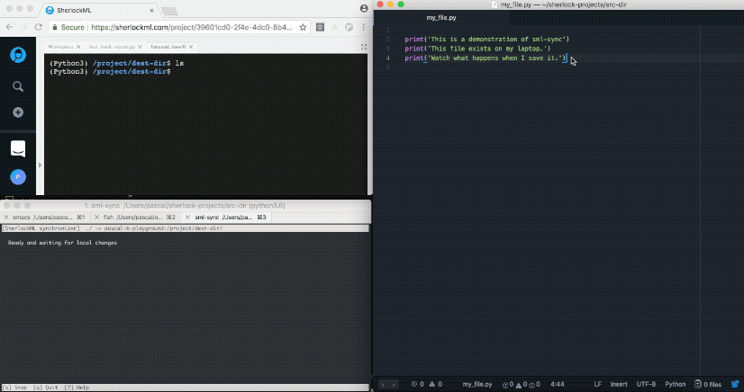

SherlockML incremental synchronization
======================================

You like writing code on your computer, but want to run the code on
[SherlockML](https://sherlockml.com). This makes that easier.

*sml-sync* is a terminal application that helps automate synchronizing a local
directory with a directory on SherlockML. It will automatically monitor a local
directory for changes and replicate those changes in a directory on SherlockML.



Installation
------------

You need a version of `rsync`. I have tested this with `rsync 2.6.9` and
`3.1.1`. This has only really been tested on macOS and Ubuntu 16.04. It will
almost certainly not work on Windows.

You will need Python 3. I recommend installing *sml-sync* in a virtual
environment.

To install, just type this in a terminal on your laptop:

```
$ curl https://bitbucket.org/theasi/sml-sync/raw/0.1.3/install.sh | bash
```

Getting started
---------------

Let's say you are developing a Jupyter extension for visualizing geographical
data on Google maps. You have the code on your laptop at `~/oss/gmaps`, and you
want to replicate this directory in the project *jupyter-gmaps* on SherlockML.

First, make sure that:

1. you have a server in the *jupyter-gmaps* project,
2. the directory `/project/gmaps` exists on SherlockML, and that it's empty.

Then, in a terminal on  *your laptop*, head to `~/oss/gmaps` and run:

```
$ cd ~/oss/gmaps
$ sml-sync jupyter-gmaps
```

You will be prompted for a remote directory. Choose `/project/gmaps`. *sml-sync*
will then compute the difference between the directory on SherlockML and
`~/oss/gmaps` and list the differences. Press `u` to push all your files up to
SherlockML. Depending on the number and size of files and your network
bandwidth, the push may take a few seconds (or longer).

Then, push `w` to start a continuous watch-sync cycle. *sml-sync* will watch the
local directory for changes and replicate them on SherlockML.

To get help on command-line options, run:

```
$ sml-sync --help
```

When the application is running, you can often type `?` to get help on a
particular screen.

Working with git repositories
-----------------------------

*sml-sync* ignores certain paths by default. In particular, it ignores paths in
`.git/`. If your code is under version control locally or on SherlockML, the git
state will not be pushed to SherlockML (but all the source files will).

Ignoring certain paths
----------------------

If you want to ignore file patterns, pass the `--ignore` argument to *sml-sync*
with a list of path patterns. For instance, to ignore anything under `dist/`
and `/docs/build`, run `sml-sync` with:

```
$ sml-sync jupyter-gmaps --ignore dist/ docs/build/
```

You can pass shell glob-like patterns to `--ignore`. Some common patterns are
ignored automatically (`.ipybnb_checkpoints`, `node_modules`, `__pycache__`
among others; for a full list, look at the [cli module](sml_sync/cli.py)).

Acknowledgements
----------------

Many people in the SherlockML team and in ASI Data Science have contributed to
the vision for *sml-sync*, both technical and at the product level. Without
their help and encouragement, *sml-sync* would not exist.

For now, this is a personal endeavour and, until such day as we see fit to bring
it under the remit of the SherlockML team proper, support questions, bug reports
etc. should be directed to Pascal personally, not to the team.
